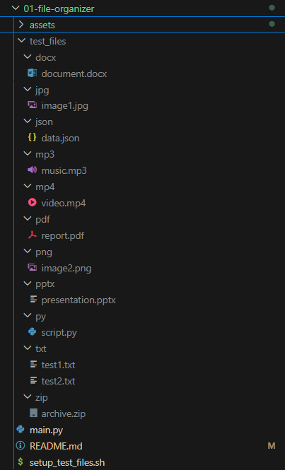

# 📁 File Organizer Automation | Automatizacija Organizacije Fajlova

## 📌 Description | Opis

EN: This project automatically organizes files in a selected folder by moving them into subfolders based on file extensions. It simulates a real-life use case where a user downloads or collects various types of files and wants to keep their workspace clean.

SR: Projekat automatski organizuje fajlove u izabranom folderu tako što ih razvrstava u podfoldere prema tipu ekstenzije. Simulira svakodnevnu situaciju kada korisnik želi da organizuje preuzete fajlove i održi urednost svog sistema.

---

## ⚙️ Features | Funkcionalnosti

- EN: Automatically detects file extensions and creates matching folders

- SR: Automatski detektuje ekstenzije fajlova i kreira odgovarajuće foldere

- EN: Moves files into designated folders based on type (e.g. `.txt`, `.jpg`, `.pdf`)

- SR: Premesta fajlove u pripadajuće foldere na osnovu tipa (npr. `.txt`, `.jpg`, `.pdf`)

- EN: Skips moving files that are already in their correct folder

- SR: Preskače fajlove koji su već u odgovarajućem folderu

- EN: Logs all actions to `log.txt`

- SR: Beleži sve akcije u `log.txt` fajl

---

## 🧠 What I Learned | Šta sam naučio

EN:

- Working with `os` and `shutil` libraries for file operations
- Creating reusable logging modules
- Using terminal and Git Bash commands
- Modularizing Python code and organizing folders
- Practicing real-world CLI automation

SR:

- Korišćenje `os` i `shutil` biblioteka za manipulaciju fajlovima
- Kreiranje višekratno upotrebljivih modula za logovanje
- Rad u terminalu i korišćenje Git Bash komandi
- Modularizacija Python koda i organizacija foldera
- Vežbanje automatizacije kroz realne CLI projekte

---

## 📂 Project Structure | Struktura Projekta

```
01-file-organizer/
│
├── assets/                      # Folder sa slikama
│   ├── 01-file-organizer-preview-1.png
│   ├── 01-file-organizer-preview-2.png
│   └── 01-file-organizer-preview-3.png
│
├── test_files/                 # Test fajlovi za organizaciju
│
├── main.py                     # Glavna skripta za organizaciju fajlova
├── logger.py                   # Modul za logovanje
├── setup_test_files.sh         # Bash skripta za kreiranje test fajlova
├── README.md                   # Opis projekta
└── log.txt                     # Log fajl aktivnosti
```

---

## 🖼️ Preview | Pregled

**EN:** Visual steps of script execution  
**SR:** Vizuelni koraci izvršavanja skripte
<div align="center">
  <table>
    <tr>
      <td align="center">
        
        <p><strong>EN:</strong> Initial folder with mixed files<br/><strong>SR:</strong> Početni folder sa izmešanim fajlovima</p>
      </td>
      <td align="center">
        
        <p><strong>EN:</strong> Organized files after script execution<br/><strong>SR:</strong> Organizovani fajlovi nakon pokretanja skripte</p>
      </td>
    </tr>
    <tr>
      <td align="center">
        
        <p><strong>EN:</strong> Script execution in terminal<br/><strong>SR:</strong> Izvršavanje skripte u terminalu</p>
      </td>
      <td align="center">
        
        <p><strong>EN:</strong> Final folder structure<br/><strong>SR:</strong> Konačna struktura foldera</p>
      </td>
    </tr>
  </table>
</div>


## 🧑‍💻 Author & Learning Goal | Autor i ciljevi učenja

**EN:**  
**Josip Pavlović** — This project is part of my 6-month plan to transition into a professional software development career. The main objective was to practice file operations, modular coding, and working with real-world directory structures in Python.

**SR:**  
**Josip Pavlović** — Ovaj projekat je deo mog šestomesečnog plana prelaska u programersku karijeru. Cilj projekta bio je da se kroz praktičan rad savladaju operacije nad fajlovima, modularno programiranje i rad sa realnim strukturom foldera u Pythonu.
