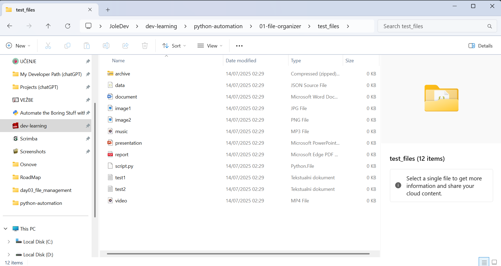
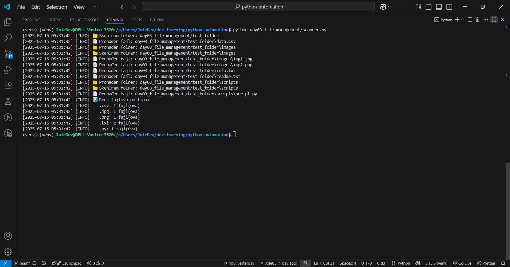

# 🐍 Python Automation Projects

## ✨ Bilingual Repository / Dvojezični repozitorijum

>**ENGLISH:** Python automation journey built through real-world scripts and terminal-based automation.  
>**SRPSKI (latinica):** Put učenja automatizacije u Python-u kroz skripte iz realnog života i rad u terminalu.
---

## 📂 Projects Overview / Pregled projekata

<table>
  <thead>
    <tr>
      <th align="left">Project</th>
      <th align="center">Preview</th>
      <th align="left">Description</th>
    </tr>
  </thead>
  <tbody>
    <tr>
      <td>
        <a href="./01-file-organizer"><strong>Day 01 – File Organizer</strong></a>
      </td>
      <td align="center">
        
        
        
        
      </td>
      <td>
        Sorts files into folders by extension using <code>os</code> and <code>shutil</code>.
      </td>
    </tr>
    <tr>
      <td>
        <a href="./day02_file_info"><strong>Day 02 – File Info Extractor</strong></a>
      </td>
      <td align="center">
        
        
        
        
      </td>
      <td>
        Extracts file metadata (name, size, type, creation date...) from target folders.
      </td>
    </tr>
    <tr>
      <td>
        <a href="./day03_file_management"><strong>Day 03 – File Management Suite</strong></a>
      </td>
      <td align="center">
        
        
        
        
      </td>
      <td>
        Modular tools for creating, cleaning, scanning and testing file structures.
      </td>
    </tr>
  </tbody>
</table>

---

## 📁 Project Folder Structure / Struktura foldera

Each project contains:
- `main.py` — core logic or CLI entry point
- `logger.py` — reusable logging module with timestamps
- `README.md` — bilingual project documentation
- `test_files/` or `test_folder/` — input data for testing
- Optional `.sh` scripts — automated test setup for Git Bash
- Screenshots stored in `assets/` folder for each project

---

## 🧠 Learning Goals / Ciljevi učenja

**ENGLISH**
- ✅ Master core Python syntax and file operations  
- ✅ Practice through realistic CLI-based projects  
- ✅ Build habit of writing clean code and structured README files  
- ✅ Learn modular programming and code reuse  
- ⏳ Expand into automation with scheduling, GUIs and web scraping  
- 🎯 Goal: job-ready Python portfolio by end of 2025

**SRPSKI**
- ✅ Učvrstiti osnove Python sintakse i rada sa fajlovima  
- ✅ Vežba kroz realne, komandno orijentisane projekte  
- ✅ Razvijanje navike dokumentacije i čistog koda  
- ✅ Učenje modularnog programiranja i ponovne upotrebe koda  
- ⏳ Proširenje na automatizaciju (GUI, scrape, cron...)  
- 🎯 Cilj: Python portfolio spreman za posao do kraja 2025.

---

## 📌 About This Repository / O repozitorijumu

This is a long-term learning archive created during my transition from civil engineering to software development.  
Each project is built from scratch using only core Python and CLI tools, with full Git versioning and markdown documentation.

Ovaj repozitorijum predstavlja arhivu mog prelaska iz građevine u IT.  
Projekti su građeni od nule, bez framework-a, uz potpuno razumevanje i Git praćenje napretka.

---

## ✅ License

This repository is licensed under the MIT License.