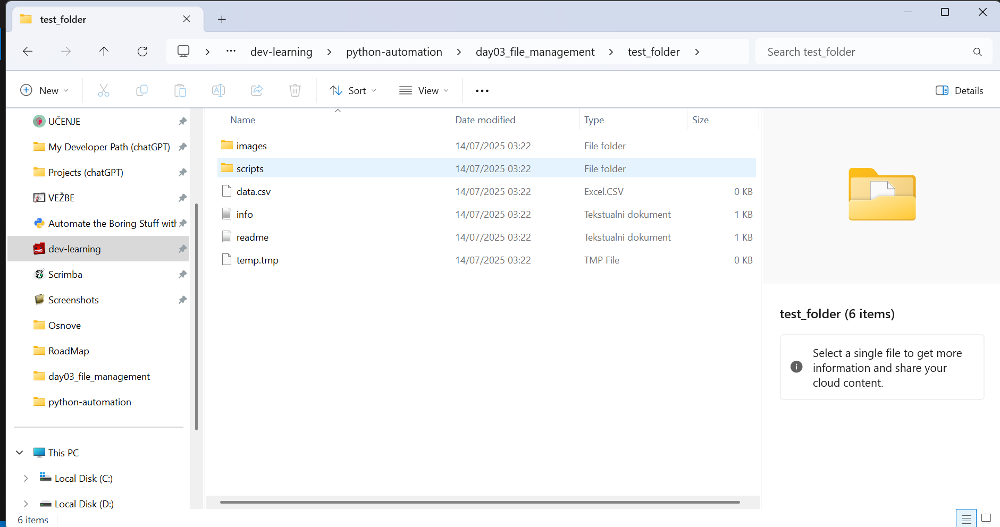
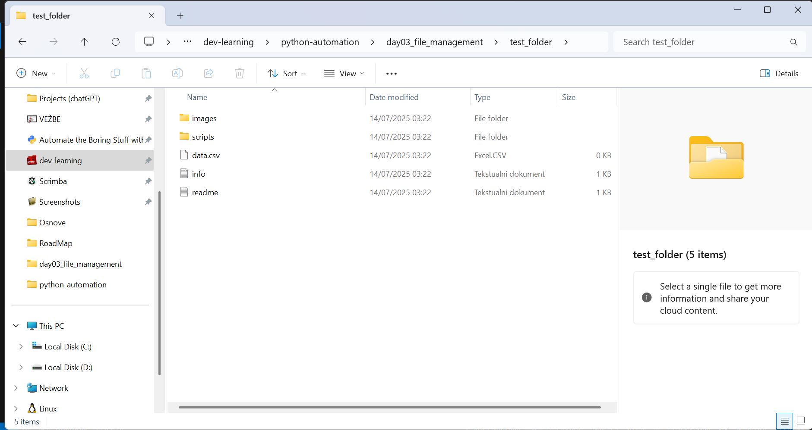

# 🐍 Python Automation Projects

> **EN/RS bilingual project repository. See project sections below.**
>
> **ENGLISH:** Python automation journey built through practical, self-paced learning over 6 months.  
> **СРПСКИ:** Пут учења аутоматизације у Python-у кроз практичан рад у периоду од 6 месеци.

---

## 📂 Projects Overview

| Day | Project Name         | Preview                                 | Description |
|-----|----------------------|------------------------------------------|-------------|
| 01  | [File Organizer](./01-file-organizer) |  | Python script that organizes files in a directory into subfolders based on file extensions. |
| 02  | [File Info Extractor](./day02_file_info) | *(preview coming soon)* | Script that reads all files in a folder and prints metadata (size, extension, creation date...). |
| 03  | [File Management Suite](./day03_file_management) |  | Modular suite for scanning, cleaning and generating reports from file structures. |

---

## 📌 About This Repo

This repository serves as a **chronological archive** of all automation mini-projects built during my transition from civil engineering to programming.

Each project folder contains:
- `main.py` – main automation logic
- `test_files/` – test samples used during development
- `README.md` – bilingual project documentation (EN/RS)
- Optional `*.sh` setup scripts for testing folders

---

## 🧠 Learning Goals (СРПСКИ)

- ✅ Чврста основа у Python синтакси и рад са фајловима
- ✅ Свакодневна вежба кроз мини-пројекте
- ✅ Развој навика писања документације и тестирања
- ⏳ Прелазак на сложеније аутоматизације (web scraping, GUI...)
- 🎯 Циљ: job-ready Python portfolio до краја 2025

---

## 🖼️ Additional Screenshots

| Project | View |
|--------|------|
| Day 01 |   |
| Day 03 |   |

---

## ✅ License

This repository is licensed under the MIT License.

---

