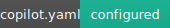
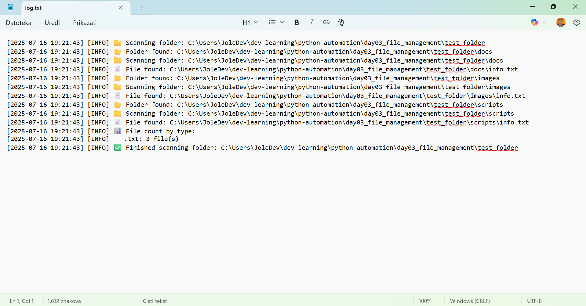

# 🐍 Python Automation Projects

<!-- Tehnički bedževi -->

<!-- Personalni i statusni bedževi -->

<!-- Status bedževi po danima -->

## ✨ Bilingual Repository | Dvojezični repozitorijum

#### 🇷🇸 Projekat sistematizovanog učenja kroz automatizaciju zadataka u Pythonu – kreiran sa ciljem da postanem profesionalni Python programer. Svaki dan je zaseban modul sa dokumentacijom, skriptama i testovima.

#### 🇬🇧 Structured learning-through-projects repository focused on task automation using Python. Built with the goal of becoming a professional Python developer. Each day is a separate, self-contained module.

---

## 📂 Projects Overview | Pregled projekata

<table>
  <thead>
    <tr>
      <th>📁 Folder</th>
      <th>🖼️ Preview</th>
      <th>📝 Description</th>
    </tr>
  </thead>
  <tbody>
<tr>
  <td>
    <a href="./01-file-organizer/README.md"><strong>Day 01 – File Organizer</strong></a>
  </td>
  <td align="center">
    
    
    
    
  </td>
  <td>
    🇬🇧: CLI project that organizes mixed files by extension into subfolders. Includes reusable logger and test generator. 
    🇷🇸: CLI projekat koji organizuje izmešane fajlove prema ekstenziji u podfoldere. Uključuje višekratno upotrebljiv logger i generator test fajlova.
  </td>
</tr>

<tr>
  <td>
    <a href="./day02_file_info/README.md"><strong>Day 02 – File Info</strong></a>
  </td>
  <td align="center">
    
    
    
    
  </td>
  <td>
    🇬🇧: Basic CLI tool for file path manipulation using `os` module. 
    🇷🇸: Osnovni CLI alat za rad sa putanjama koristeći `os` modul.
  </td>
</tr>

<tr>
  <td>
    <a href="./day03_file_management/README.md"><strong>Day 03 – File Management Suite</strong></a>
  </td>
  <td align="center">
    
    
    
    
    
    
  </td>
  <td>
    🇬🇧: Modular tools for creating, cleaning, scanning and documenting folder/file structures. 
    🇷🇸: Modularni alati za kreiranje, čišćenje, skeniranje i dokumentovanje struktura fajlova i foldera.  
    📜 Scripts: `scanner.py`, `cleaner.py`, `size_cleaner.py`, `file_structure_creator.py`, `image_report.py`, `logger.py`, `setup_test_folder.sh`
  </td>
</tr>

<tr>
  <td>
    <a href="./day04_datetime"><strong>Day 04 – Timestamp Toolkit</strong></a>
  </td>
  <td align="center">
    
    
    
    
  </td>
  <td>
    🇬🇧: Tools for generating timestamped folders, checking file age, and working with datetime objects. 
    🇷🇸: Alati za kreiranje foldera sa vremenskom oznakom, proveru starosti fajlova i rad sa datumima/vremenima.  
    📜 Scripts: `timestamp_generator.py`, `dated_folder_creator.py`, `old_file_checker.py`, `logger.py`, `main.py`
  </td>
</tr>
  </tbody>
</table>

## 📘 Documentation

#### 📁 All cheatsheets and guides can be found in [`/docs`](./docs) folder:

- [Learning Roadmap](docs/learning_roadmap.md)
- [AI Workflow & Copilot Setup](docs/ai_integration_guide.md)
- [Logger Cheatsheet](docs/logger_cheatsheet.md)
- [CLI Tools (Bash, Magick, ffmpeg)](docs/cli_toolkit_cheatsheet.md)
- [Python Imports & Builtins](docs/python_imports_and_modules.md)
- [Python Testing Guide](docs/python_testing_guide.md)
- [Pylance & VS Code Tips](docs/ide_and_linting/pylance_explained.md)
- [HTML in Markdown](docs/ide_and_linting/html_markdown_guide.md)

---

## 🤖 GitHub Copilot Configuration | GitHub Copilot konfiguracija

#### 🇬🇧: This repository uses a [`.github/copilot.yaml`](./.github/copilot.yaml) configuration file to guide GitHub Copilot's behavior.

#### 🇷🇸: Ovaj repozitorijum koristi fajl [`.github/copilot.yaml`](./.github/copilot.yaml) za konfiguraciju ponašanja GitHub Copilot-a.

#### 🇬🇧: Key configurations include:

- Bilingual Markdown documentation (English + Serbian Latin)
- Professional tone and full comment style
- Python-first automation workflows
- No external dependencies unless explicitly stated
- UTC timestamps and descriptive variable naming

#### 🇷🇸: Ključna podešavanja uključuju:

- Dvojezična dokumentacija u Markdown fajlovima (engleski + srpska latinica)
- Profesionalan ton i stil komentara
- Automatizacija zasnovana na Python skriptama
- Nema spoljašnjih zavisnosti osim ako nije eksplicitno navedeno
- Upotreba UTC vremena i deskriptivno imenovanje promenljivih

---

## 🧠 Author

**Josip Pavlović**
🛠️ Civil Engineer ➝ Python Developer
📍 Novi Sad, Serbia
🔗 [github.com/Jole85](https://github.com/Jole85)

---

## ✅ License

#### 🇬🇧: This repo is licensed under the **MIT License**.

#### 🇷🇸: Ovaj repo je licenciran pod **MIT licencom**.

📌 _Last updated: 2025-07-21_
