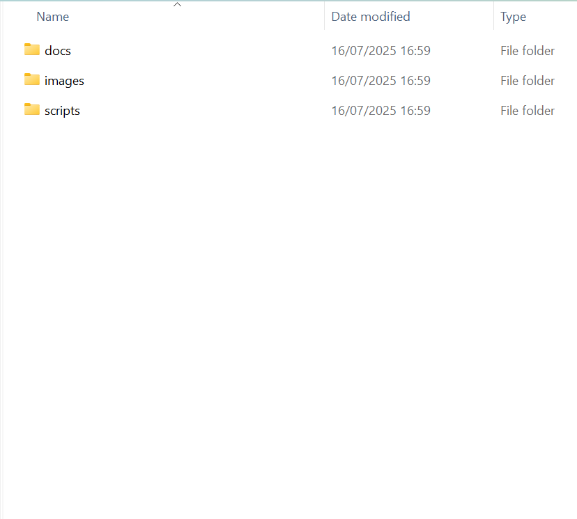
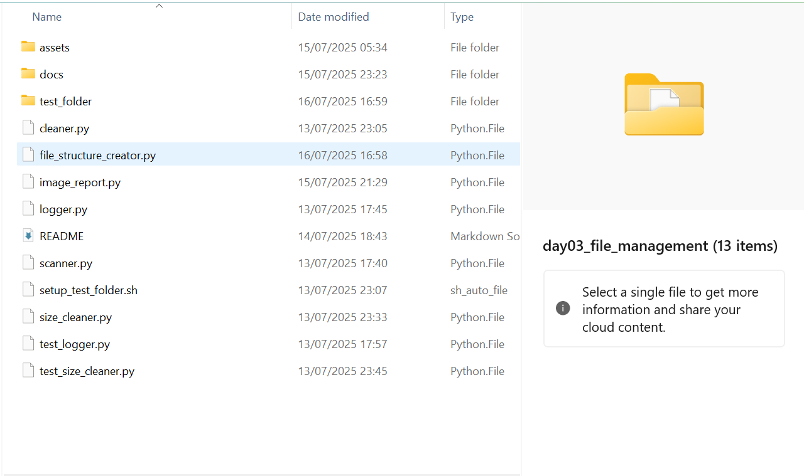
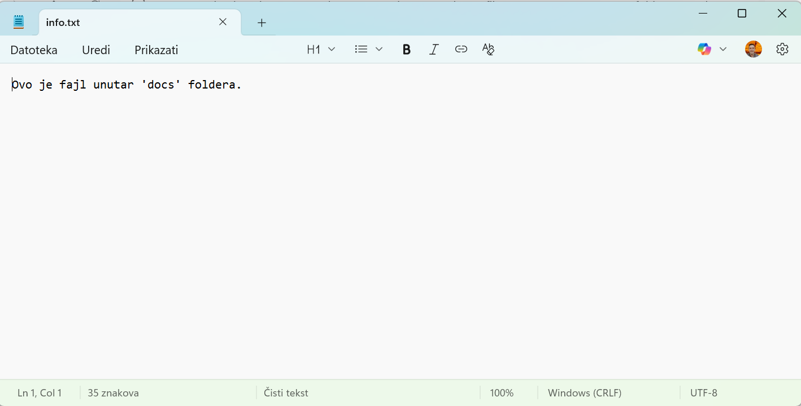
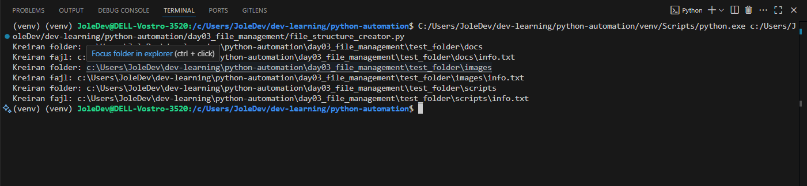

# 🧱 File Structure Creator – Cheatsheet

## 📌 Purpose | Svrha
#### 🇬🇧: Automatically creates a standard folder and file structure for testing other Python scripts in the project.  
#### 🇷🇸: Automatski kreira standardnu strukturu foldera i fajlova za testiranje drugih Python skripti u okviru projekta.

---

## 🧠 What it Demonstrates | Šta demonstrira

- Use of `os` module for file and folder operations | Upotrebu `os` modula za operacije sa fajlovima i folderima
- Cross-platform path joining with `os.path.join` | Spajanje putanja univerzalnih za sve platforme (Windows, Mac, Linux itd.) pomoću `os.path.join`
- File writing using `open()` and context manager (`with`) | Upisivanje sadržaja u fajlove korištenjem `open()` i kontekst menadžera (`with`)
- Script automation for repetitive project setup | Skripta automatizuje postupak kreiranja strukture fajlova i foldera potrebnih za projekat

---

## 🧩 Code Explanation | Objašnjenje koda

```python
import os
```
#### 🇬🇧: Imports the built-in module for interacting with the file system.  
#### 🇷🇸: Uvozi ugrađeni modul za rad sa fajl sistemom.

```python
folder_structure = {
    "Documents": ["doc1.txt", "doc2.txt"],
    "Images": ["img1.jpg", "img2.png"],
    "Videos": ["video1.mp4"],
    "EmptyFolder": []
}
```
#### 🇬🇧: Dictionary defines folder names as keys and a list of files to create within them as values.  
#### 🇷🇸: Rečnik definiše nazive foldera kao ključeve i listu fajlova koji se kreiraju unutar njih kao vrednosti.

```python
base_dir = "test_folder"
```
#### 🇬🇧: The root folder under which all test folders and files will be created.  
#### 🇷🇸: Root folder u kojem će biti kreirani svi test folderi i fajlovi.

```python
os.makedirs(base_dir, exist_ok=True)
```
#### 🇬🇧: Creates the base directory. If it exists, no error is raised.  
#### 🇷🇸: Kreira osnovni direktorijum. Ako već postoji, greška se ne prijavljuje.

```python
for folder, files in folder_structure.items():
    path = os.path.join(base_dir, folder)
    os.makedirs(path, exist_ok=True)
```
#### 🇬🇧: Iterates through each folder, joins its path with `base_dir` and creates it.  
#### 🇷🇸: Prolazi kroz svaki folder, spaja njegovu putanju sa `base_dir` i kreira ga.

```python
for file in files:
    file_path = os.path.join(path, file)
    with open(file_path, "w") as f:
        f.write(f"This is {file}")
```
#### 🇬🇧: For each file in the list, creates an empty file and writes sample text into it.  
#### 🇷🇸: Za svaki fajl iz liste kreira se fajl i u njega se upisuje primer teksta.

---

## 📚 Related Concepts | Povezani koncepti

- `os.makedirs()`: creates directories recursively | rekurzivno kreira datoteke(foldere)
- `os.path.join()`: safe way to join file paths |siguran način za spajanje putanja datoteka(foldera)
- `with open(...)`: ensures file is properly closed | osigurava da je datoteka pravilno zatvorena
- `f.write(...)`: writes content into a file | zapisuje sadržaj u fajl

---
<h2>🖼️ Script in Action / Izvršavanje skripte</h2>

<table align="center">
  <tr>
    <td align="center">
      <br/>
      <p><strong>🇬🇧</strong> Explorer before script execution<br/>
         <strong>🇷🇸</strong> Explorer pre pokretanja skripte</p>
    </td>
    <td align="center">
      <br/>
      <p><strong>🇬🇧</strong> Script execution – folders are being created<br/>
         <strong>🇷🇸</strong> Pokretanje skripte – kreiraju se folderi</p>
    </td>
    <td align="center">
      <br/>
      <p><strong>🇬🇧</strong> New folder <code>test_folder</code> appears in explorer<br/>
         <strong>🇷🇸</strong> Novi folder <code>test_folder</code> pojavljuje se u exploreru</p>
    </td>
  </tr>
  <tr>
    <td align="center">
      <br/>
      <p><strong>🇬🇧</strong> Structure of <code>test_folder</code> in VS Code<br/>
         <strong>🇷🇸</strong> Struktura foldera <code>test_folder</code> u VS Codu</p>
    </td>
    <td align="center">
      <br/>
      <p><strong>🇬🇧</strong> Content of file <code>info.txt</code><br/>
         <strong>🇷🇸</strong> Sadržaj fajla <code>info.txt</code></p>
    </td>
    <td align="center">
      <br/>
      <p><strong>🇬🇧</strong> Script output log in terminal<br/>
         <strong>🇷🇸</strong> Izlazni log skripte u terminalu</p>
    </td>
  </tr>
</table>


## 🚀 Ideas for Extension | Ideje za proširenje

- Add subfolders to each category | Dodaj podfoldere za svaku kategoriju
- Add logic to populate files with specific content templates | Dodajte logiku za popunjavanje fajlova određenim sadržajem
- Generate random content using `faker` module | Generiranje slučajnog sadržaja pomoću `faker` modula
- Include file types like `.json`, `.csv`, etc. | Uključite tipove datoteka kao što su `.json`, `.csv` itd.

