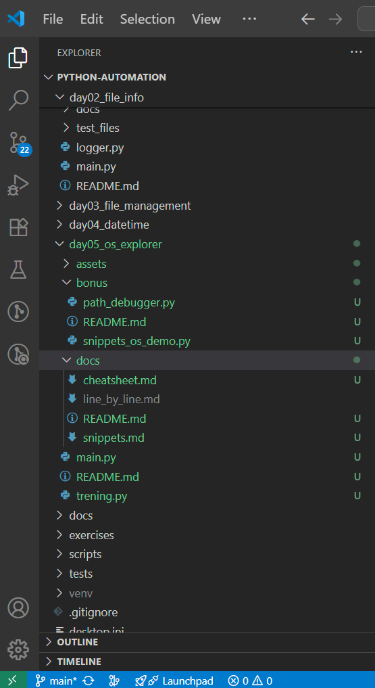

# 📂 day05_os_explorer

<p align="left">
  
  
  
  
  
</p>

**Project type:** Python Automation  
**Date:** 2025-08-01  
**Status:** ✅ Completed

---

### 🖼️ Preview Images / Pregled slika

<table align="center">
  <tr>
    <td align="center">
      <br/>
      <strong>EN:</strong> Project folder with all components<br/>
      <em>SR:</em> Projektni folder sa svim komponentama
    </td>
    <td align="center">
      <br/>
      <strong>EN:</strong> Script run and user input<br/>
      <em>SR:</em> Pokretanje skripte i unos korisnika
    </td>
  </tr>
  <tr>
    <td align="center">
      <br/>
      <strong>EN:</strong> Function that moves file to folder<br/>
      <em>SR:</em> Funkcija za premeštanje fajla u folder
    </td>
    <td align="center">
      <br/>
      <strong>EN:</strong> Path debugger for learning<br/>
      <em>SR:</em> Debugger putanje za vežbu i razumevanje
    </td>
  </tr>
</table>

---

## 🇬🇧: 📌 Description

This project is a training environment for exploring the `os` module in Python.  
It allows:

- Viewing and verifying file paths
- Moving a file into a selected folder
- Testing `os` and `os.path` functions via demo snippets
- Debugging path issues with a separate script

Modular approach is implemented via `trening.py`.

---

## 🇷🇸: 📌 Opis

Ovaj mini-projekat predstavlja vežbu za rad sa `os` modulom u Python-u.  
Omogućava:

- Prikaz i proveru putanja do fajlova
- Premeštanje fajla u izabrani folder
- Testiranje `os` i `os.path` funkcija kroz snippete
- Debugovanje putanja kroz posebnu skriptu

Modularni pristup je realizovan pomoću `trening.py`.

---

## 🧠 What I Learned | Šta sam naučio

- Exploring filesystem with `os` and `os.path` | _Rad sa fajl sistemom uz pomoć `os` i `os.path`_
- Moving files using custom `move_to_directory()` | _Premeštanje fajlova pomoću vlastite funkcije_
- Refactoring reusable logic into a module | _Modularizacija funkcionalnosti za ponovnu upotrebu_
- Script separation for demo/debug purposes | _Odvajanje skripti za demonstraciju i debagovanje_
- Writing bilingual documentation | _Pisanje dvojezične dokumentacije_

---

## 🚀 How to Run | Kako pokrenuti

```bash
python main.py
```

- EN: Follow terminal instructions | _SR: Prati instrukcije u terminalu_

---

## 📁 Folder Structure | Struktura Projekta

```
day05_os_explorer/
│
├── assets/
│   ├── day05_status.svg
│   ├── day05_folder_preview.png
│   ├── day05_terminal_run.png
│   ├── day05_trening_move.png
│   └── day05_bonus_debugger.png
│
├── bonus/
│   ├── path_debugger.py
│   └── snippets_os_demo.py
│
├── docs/
│   ├── README.md
│   ├── cheatsheet.md
│   └── snippets.md
│
├── main.py
├── trening.py
└── README.md
```

---

## ©️ Author | Autor

[](https://github.com/Jole85)
[](https://github.com/Jole85/python-automation)

**Josip Pavlović**
_Aspiring Python developer from Novi Sad_
🔗 [LinkedIn Profile](https://www.linkedin.com/in/josip-p-151951338/)

---
