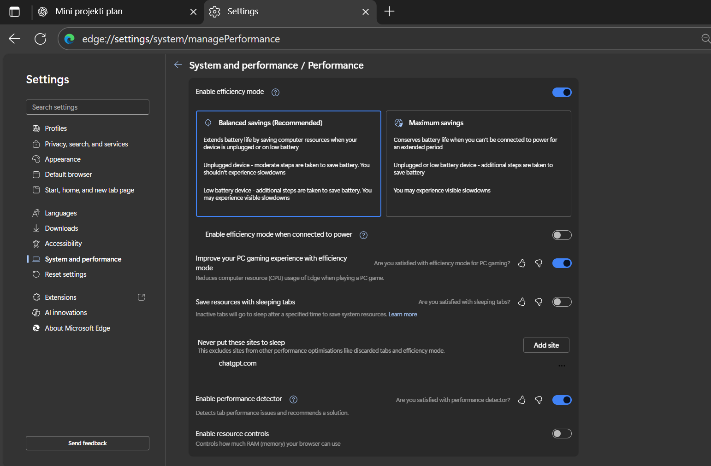

# 🌐 Browser Settings for Stable ChatGPT Usage

---

## 🔹 Chrome (ako ga koristiš) | _Chrome (if you use it)_

1. **Flags podešavanja**

   - Otvori: `chrome://flags`
   - Pretraži: **Calculate Window Occlusion on Windows**
   - Ako postoji → **Disable**
   - Ako ga nema, Google ga je uklonio u novijoj verziji Chrome-a (nije potrebno podešavanje).

2. **Cache & cookies čišćenje**
   - `Ctrl + Shift + Del` → očisti sve osim lozinki.
   - Radi to periodično (npr. 1x nedeljno).

---

## 🔹 Edge (preporučeno) | _Edge (recommended)_

### 1️⃣ Flags podešavanja

- Otvori: `edge://flags`
- Pretraži: **Calculate Window Occlusion on Windows**
- Ako postoji → **Disable**
- U novijim verzijama Edge-a opcija ne postoji → preskoči.

### 2️⃣ System & Performance podešavanja

- Otvori: `edge://settings/system`

- **Efficiency mode**:

  - Isključen kada je laptop na struji (✅).
  - Uključi ručno kada koristiš bateriju, ako želiš da štediš bateriju.

- **Save resources with sleeping tabs**:

  - Drži isključeno kada radiš duge sesije (✅).
  - Ako je uključeno → dodaj `chat.openai.com` u listu "Never put these sites to sleep" (što je već urađeno).

- **Enable performance detector**:

  - Može da ostane uključen (✅) – obaveštava te o uskim grlima performansi.

- **Enable resource controls**:

  - Ostaviti isključeno za maksimalnu stabilnost.

- **Startup Boost**:
  - Možeš da ga isključiš jer nema uticaj na performanse ChatGPT-a, samo na brzinu pokretanja Edge-a.

---

## 🔹 Generalne preporuke | _General recommendations_

- **Očisti cache & cookies**: `Ctrl + Shift + Del` → očisti sve osim lozinki.
- **Ne otvaraj previše tabova** paralelno kada koristiš ChatGPT (smanjuje šansu za usporavanje).
- **Koristi Edge** jer je stabilniji za duge sesije.

---

📌 Ove postavke minimizuju zamrzavanja tabova i problem "Page Unresponsive" tokom rada u ChatGPT-u.

---
