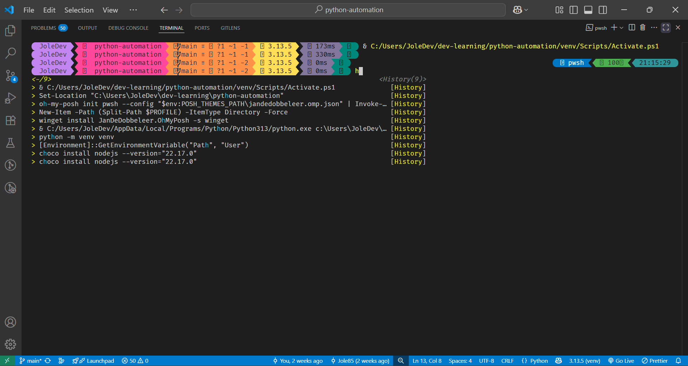

# 🖥️ Terminal & PowerShell Setup Guide

Ovaj vodič pokriva: | _This guide covers:_

- Podešavanje terminal profila u VS Code-u | _Setting terminal profiles in VS Code_
- Navigaciju i prilagođavanje izgleda terminala | _Navigation and customizing terminal appearance_
- PowerShell profil i Oh-My-Posh | _PowerShell profile and Oh-My-Posh_
- Rešenje za grešku sa digitalnim potpisom (Execution Policy) | _Fix for digital signature error (Execution Policy)_
- Debug greške sa PSReadLine i kako ih rešiti | _Debugging PSReadLine errors and how to fix them_

---

## ✅ Terminal profiles in VS Code | _Profili terminala u VS Code-u_

### 1️⃣ Add profiles in `settings.json` | _Dodaj profile u `settings.json`_

```json
"terminal.integrated.profiles.windows": {
  "PowerShell": {
    "path": "C:\\Program Files\\PowerShell\\7\\pwsh.exe"
  },
  "Command Prompt": {
    "path": "C:\\Windows\\System32\\cmd.exe"
  },
  "Git Bash": {
    "path": "C:\\Program Files\\Git\\bin\\bash.exe"
  }
},
"terminal.integrated.defaultProfile.windows": "PowerShell"
```

- Aktivira **PowerShell 7**, CMD i Git Bash profile | _Enables **PowerShell 7**, CMD and Git Bash profiles_
- Moderni PowerShell koristi se kao glavni terminal. | _Modern PowerShell is used as the main terminal._

---

## 🔁 Task-runner problem: `python` not recognized | _Problem sa Task-runner-om: `python` nije prepoznat_

Ako pokretanjem Alt+R dobiješ grešku: | _If when pressing Alt+R you get an error:_

```
The argument 'python' is not recognized...
```

### ✅ Rešenje | _Solution_

U `tasks.json`, koristi `"command": "python.exe"` umesto `"python"`: | _Use `"command": "python.exe"` instead of `"python"` in `tasks.json`:_

```json
"command": "python.exe"
```

Ili koristi apsolutnu putanju do `python.exe` iz tvog venv-a. | _Or use the absolute path to `python.exe` from your venv._

---

## ⚡ PowerShell Profile Setup | _Podešavanje PowerShell profila_

### 1️⃣ Aktivan PowerShell profil (`Microsoft.PowerShell_profile.ps1`) | _Active PowerShell profile_

```powershell
# Inicijalizacija Oh-My-Posh | _Initialize Oh-My-Posh_
oh-my-posh init pwsh --config "$env:POSH_THEMES_PATH\jandedobbeleer.omp.json" | Invoke-Expression

# Radni folder | _Working folder_
Set-Location "C:\Users\JoleDev\dev-learning\python-automation"

# PSReadLine opcije (ako koristiš PowerShell 7+) | _PSReadLine options (if using PowerShell 7+)
Set-PSReadlineOption -PredictionSource History
Set-PSReadlineOption -PredictionViewStyle ListView
Set-PSReadlineOption -Colors @{
    "Command"   = "Yellow"
    "Parameter" = "Cyan"
    "Operator"  = "Green"
    "String"    = "Magenta"
}

# Alias-i | _Aliases_
Set-Alias ll Get-ChildItem
Set-Alias la "Get-ChildItem -Force"
Set-Alias cls Clear-Host
Set-Alias q exit
Function Edit-Profile { notepad $PROFILE }
Function Reload-Profile { . $PROFILE }
```

📌 Ako dobiješ grešku kao što je: | _If you get an error like:_

```
A parameter cannot be found that matches parameter name 'PredictionSource'
```

✅ To znači da koristiš **stari Windows PowerShell**, a ne `pwsh.exe`. | _This means you are using the old Windows PowerShell and not `pwsh.exe`._
➡️ Reši tako što u `settings.json` postaviš `"pwsh.exe"` kao putanju. | _Fix by setting `"pwsh.exe"` as the path in `settings.json`._
➡️ Takođe obrisi ili isključi profile za `powershell.exe`. | _Also remove or disable profiles for `powershell.exe`._

---

## 🔒 Execution Policy — Rešavanje digitalnog potpisa | _Fixing digital signature issues_

Greška: | _Error:_

```
cannot be loaded because running scripts is disabled...
```

### ✅ Rešenje | _Solution_

Pokreni (kao administrator): | _Run (as administrator):_

```powershell
Set-ExecutionPolicy -Scope CurrentUser RemoteSigned
```

➡️ Izaberi `A` (Yes to All) kad se traži potvrda. | _Choose `A` (Yes to All) when prompted._
➡️ Ovo omogućava pokretanje lokalnog `$PROFILE` skripta. | _This allows the local `$PROFILE` script to run._

---

## 📸 Prikaz izgleda | _Appearance preview_



👆 Terminal prikazuje prompt iz `jandedobbeleer.omp.json`, aktiviran `venv`, i radi u folderu `python-automation`. | _Terminal shows prompt from `jandedobbeleer.omp.json`, venv is active, and it's working in the `python-automation` folder._

---

## 👨‍💻 Author | _Autor_

[](https://github.com/Jole85)

**Josip Pavlović — aspiring Python developer from Novi Sad**

---
