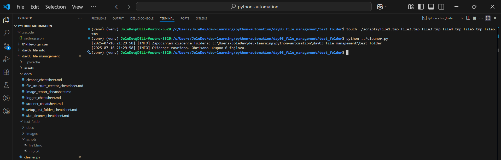
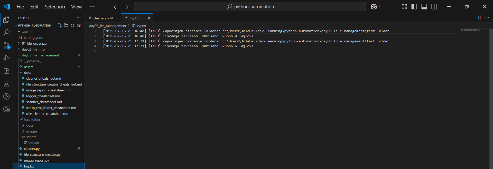

# 🧹 cleaner.py Cheatsheet

## 📄 Description | Opis

#### 🇬🇧: The `cleaner.py` script is used to delete unwanted files (default: `.tmp`) from a specified directory and all its subdirectories.

#### 🇷🇸: Skripta `cleaner.py` služi za brisanje neželjenih fajlova (podrazumevano: `.tmp`) iz izabranog foldera i svih njegovih podfoldera.
---
## 🖼️ Visual Walkthrough | Vizuelni vodič

| Step 1 | Step 2 |
|--------|--------|
|  |  |
| **🇬🇧**: Open `cleaner.py` and confirm the relative path logic using `os.path.join(...)`. <br> **🇷🇸**: Otvori `cleaner.py` i proveri da li koristi relativnu putanju uz pomoć `os.path.join(...)`. | **🇬🇧**: Prepare the `scripts` folder inside `test_folder` and generate `.tmp` files. <br> **🇷🇸**: Pripremi `scripts` folder unutar `test_folder` i kreiraj `.tmp` fajlove. |

| Step 3 | Step 4 |
|--------|--------|
|  |  |
| **🇬🇧**: Execute `cleaner.py` to trigger the cleaning logic. Observe terminal log. <br> **🇷🇸**: Pokreni `cleaner.py` da bi aktivirao logiku za čišćenje. Posmatraj log u terminalu. | **🇬🇧**: Final log shows 6 files deleted successfully. <br> **🇷🇸**: Završni log prikazuje uspešno brisanje 6 fajlova. |


## 🔍 How It Works | Kako funkcioniše

#### 🇬🇧:  
- Uses `os.walk()` to recursively traverse folders  
- Deletes files based on extension  
- Logs every action using the `logger.py` module  

#### 🇷🇸:  
- Koristi `os.walk()` za rekurzivni prolazak kroz foldere  
- Briše fajlove na osnovu ekstenzije  
- Sve akcije loguje preko modula `logger.py`

---
## 🧠 Key Concepts

```python
base_folder = os.path.join(os.path.dirname(__file__), "test_folder")
```

#### 🇬🇧: 📌 This line ensures that the script always targets the `test_folder` relative to the script's own location, regardless of the terminal's working directory.

#### 🇷🇸: 📌 Ova linija obezbeđuje da skripta uvek cilja `test_folder` u odnosu na lokaciju same skripte, bez obzira na to iz kog foldera je terminal pokrenut.

---

## 🔧 Usage

```bash
python cleaner.py
```

#### 🇬🇧: This will delete all `.tmp` files inside the `test_folder` directory structure.
#### 🇷🇸: Ova komanda briše sve `.tmp` fajlove u okviru `test_folder` strukture direktorijuma.

---

## ⚙️ Main Function | Glavna funkcija

```python
def clean_folder(folder_path, extension=".tmp"):
    ...
```

| Parametar/ Parameter      | Tip / Type   |Podrazumevano / By default | Description (🇬🇧)                    | Opis (🇷🇸)                                  |
|----------------|--------|---------|-------------------------------------|---------------------------------------------|
| `folder_path`  | str    | —       | Path to target directory            | Putanja do ciljnog direktorijuma            |
| `extension`    | str    | `.tmp`  | File extension to delete            | Ekstenzija fajlova za brisanje              |


## 🪵 Logging | Logovanje

#### 🇬🇧:  
- All messages are recorded using `log()` from `logger.py`
- Log levels used: `INFO`, `ERROR`  
- Example log output:

```
INFO: Starting to clean folder: test_folder
INFO: Deleted file: test_folder/temp1.tmp
INFO: Cleanup complete. Total 2 files deleted.
```

#### 🇷🇸:  
- Sve poruke se beleže pomoću `log()` iz `logger.py`  
- Korišćeni nivoi logovanja: `INFO`, `ERROR`  
- Primer ispisa loga:

```
INFO: Započinjem čišćenje foldera: test_folder
INFO: Obrisan fajl: test_folder/temp1.tmp
INFO: Čišćenje završeno. Obrisano ukupno 2 fajlova.
```

---

## 🧪 Example Usage | Primer korišćenja

```python
if __name__ == "__main__":
    base_folder = os.path.join(os.path.dirname(__file__), "test_folder")
    clean_folder(base_folder, extension=".tmp")
```

#### 🇬🇧: This runs the script directly and deletes all `.tmp` files in `test_folder`.
#### 🇷🇸: Ova komanda pokreće skriptu direktno i briše sve `.tmp` fajlove iz foldera `test_folder`.

---

## 📁 Files Affected | Fajlovi koji se brišu

#### 🇬🇧:  
- Files with the specified extension (default `.tmp`)  
- In all nested directories

#### 🇷🇸:  
- Fajlovi sa navedenom ekstenzijom (podrazumevano `.tmp`)  
- U svim podfolderima

---

## 🛡️ Error Handling | Rukovanje greškama

#### 🇬🇧:  
- Every deletion is wrapped in a `try/except` block  
- All exceptions are logged  
- No crash will stop the script

#### 🇷🇸:  
- Svako brisanje je obuhvaćeno `try/except` blokom  
- Sve greške se loguju  
- Ni jedna greška neće zaustaviti izvršavanje skripte

---

## 💡 Useful For | Korisno za:

#### 🇬🇧:  
- Cleaning up temporary build files  
- Resetting test directories  
- Regular maintenance scripts

#### 🇷🇸:  
- Čišćenje privremenih fajlova nakon build-a  
- Resetovanje test foldera  
- Redovno održavanje skripti

