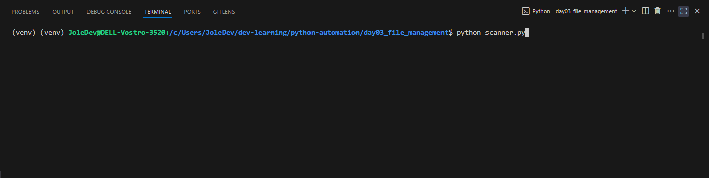
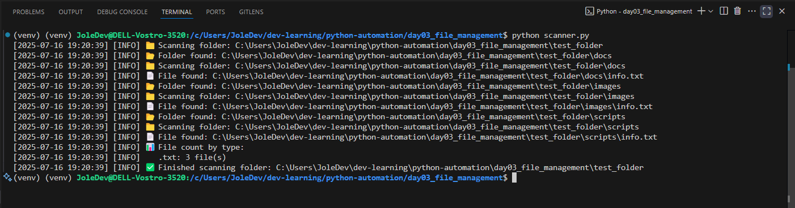
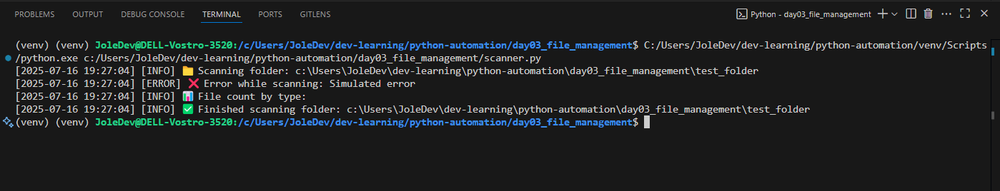
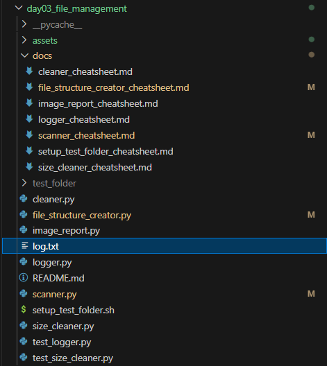

# 🧪 Scanner Cheatsheet | Vodič za Scanner skriptu

#### 🇬🇧: A bilingual guide for understanding and using the `scanner.py' script within the **Day 03 – File Management Suite** project.
#### 🇷🇸: Dvojezični vodič za razumevanje i upotrebu `scanner.py` skripte u okviru projekta **Day 03 – File Management Suite**.

## 📌 Purpose | Svrha

#### 🇬🇧: The `scanner.py` script scans a target folder and lists all files with their absolute paths and sizes. Useful for analyzing directory contents and identifying large files.
#### 🇷🇸: Skripta `scanner.py` skenira ciljni folder i prikazuje sve fajlove sa njihovim apsolutnim putanjama i veličinama. Korisno za analizu sadržaja foldera i pronalaženje velikih fajlova.

---

## 📁 Target Folder Path Explained / Objašnjenje putanje

```python
target_folder = os.path.join(os.path.dirname(__file__), "test_folder")
```

#### 🇬🇧: This line ensures the folder `test_folder` is always located in the same directory as the script, regardless of where the script is executed from.
#### 🇷🇸: Ova linija osigurava da je folder `test_folder` uvek lociran u istom folderu gde i skripta, bez obzira na to odakle se skripta pokreće.


---

## 🖼️ Preview Images / Prikaz slika

<table>
  <tr>
    <td align="center">
      <br/>
      <strong>Terminal Execution / Pokretanje skripte</strong><br/>
      Shows initial execution from the terminal.<br/>
      Prikazuje inicijalno pokretanje iz terminala.
    </td>
    <td align="center">
      <br/>
      <strong>Output Display / Prikaz rezultata</strong><br/>
      Lists scanned files with full paths and sizes.<br/>
      Prikaz fajlova sa putanjama i veličinama.
    </td>
    <td align="center">
      <br/>
      <strong>VS Explorer before running the script / VS Explorer pre pokretanja skripte</strong><br/>
      <code>log.txt</code> file does not exist.<br/>
      <code>log.txt</code> trenutno ne postoji.
    </td>
  </tr>
  <tr>
    <td align="center">
      <br/>
      <strong>Logging Info / Logovanje informacija</strong><br/>
      Logging details of scanned files.<br/>
      Logovanje detalja skeniranih fajlova.
    </td>
    <td align="center">
      <br/>
      <strong>Error Handling / Rukovanje greškama</strong><br/>
      Example with corrupted/missing file.<br/>
      Primer greške pri otvaranju fajla.
    </td>
    <td align="center">
      <br/>
      <strong>VS Explorer after running the script / VS Explorer posle pokretanja skripte</strong><br/>
      Fajl <code>log.txt</code> je kreiran u folderu u kom se nalazi skripta.<br/>
      The file <code>log.txt</code> is created in the folder where the script is located.
    </td>
  </tr>
</table>


## 📁 Output | Izlaz

#### 🇬🇧: Prints the folder structure, listing each file and subfolder with indentation to reflect hierarchy.

#### 🇷🇸: Prikazuje strukturu direktorijuma, navodeći svaki fajl i podfolder sa uvlačenjem koje odražava hijerarhiju.

---

## 🧠 Key Concepts | Ključni koncepti

| Concept                     | Python Modules/Functions      | Objašnjenje (🇷🇸/🇬🇧) |
|----------------------------|-------------------------------|---------------------|
| Directory Traversal        | `os.walk()`                   | Šeta kroz strukturu direktorijuma / Traverses directories |
| Indented Output            | `level * "  "`                | Vizuelno prikazuje hijerarhiju foldera / Shows folder depth |
| Argument Handling          | `sys.argv`, `len(sys.argv)`   | Čita argumente iz komandne linije / Parses command-line args |
| Path Manipulation          | `os.path.join()`              | Spaja putanje bez grešaka / Joins paths safely |
| Basic Validation           | `if not os.path.isdir()`      | Proverava da li je putanja validan direktorijum / Validates input path |

---
## 🧩 Sample Output | Primer izlaza

```
📁 test_folder
  📄 file1.txt
  📄 file2.txt
  📁 subfolder
    📄 image.png
```
## ✅ Summary / Rezime
#### 🇬🇧:
- Modular file scanning logic with full path awareness  
- Safe execution across environments using `__file__`  
- Clear logging for each scanned file  
- Practical use for automation and analysis
#### 🇷🇸:
- Modularna logika za skeniranje fajlova  
- Bezbedno izvršavanje korišćenjem `__file__`  
- Jasno logovanje svakog fajla  
- Praktično za automatizaciju i analizu
---

## ✍️ Author Note | Napomena autora

#### 🇬🇧: This script was created as a practice in recursive directory exploration and argument validation, aiming to understand how directory trees can be visualized in terminal.
#### 🇷🇸: Skripta je nastala kao vežba u rekurzivnom pretraživanju direktorijuma i validaciji argumenata. Cilj je bio vizualizovati strukturu direktorijuma u terminalu.

